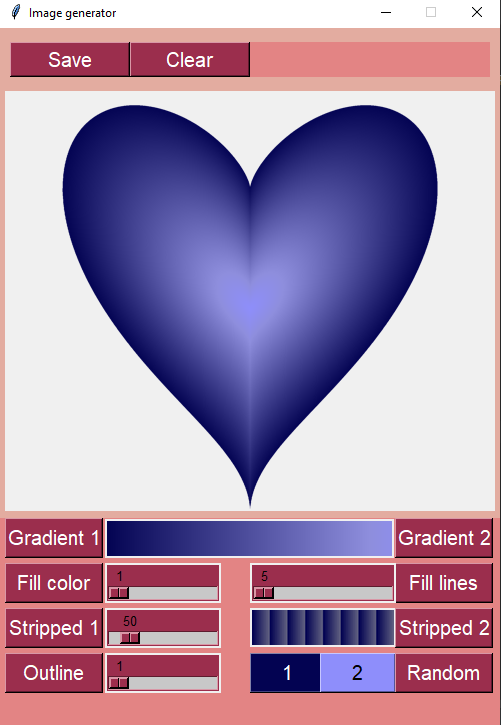
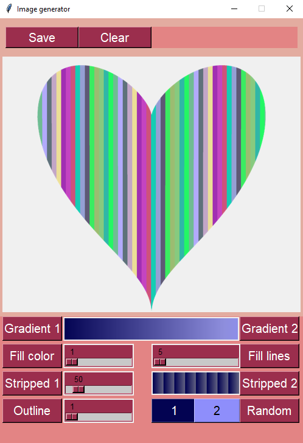
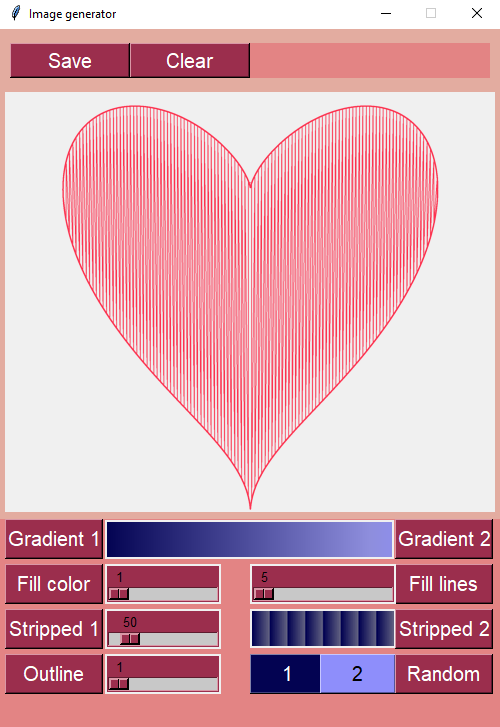
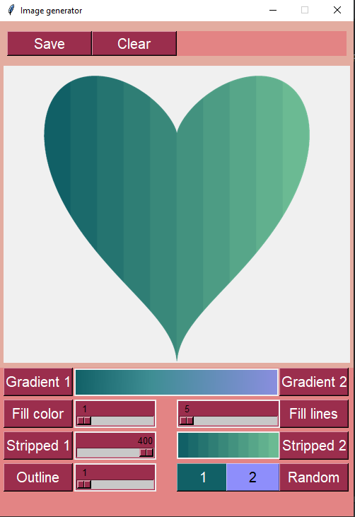
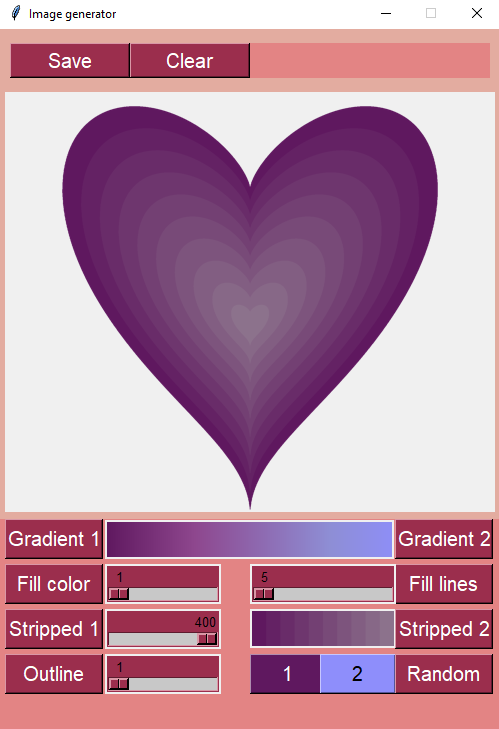
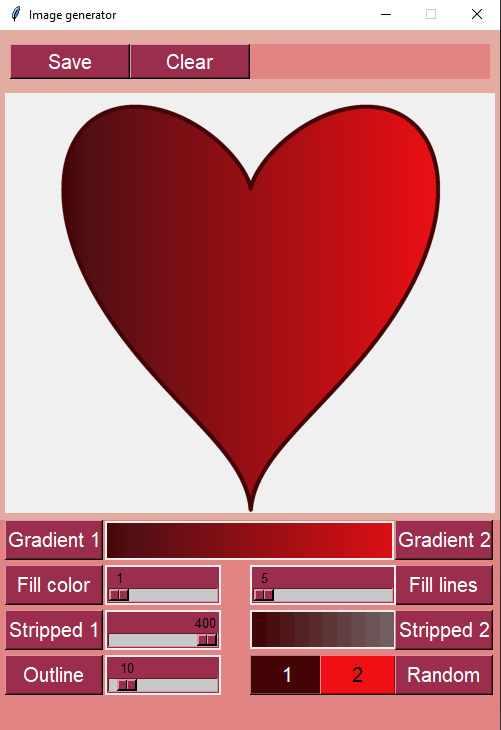

# PIL Heart Generator
***
Very simple and intuitive GUI for creating heart images and saving them in .png. Based on Pillow library for Python.
***
## Getting started.
1. You'll need to clone repository.
```
$ git clone https://github.com/crawlic-stud/HeartGenerator.git
```
2.1 You can run it with Python:
```
$ pip install Pillow
$ python GUI.py
```
2.2 Or you can just open GUI.exe file:


***
## Examples:






***
            